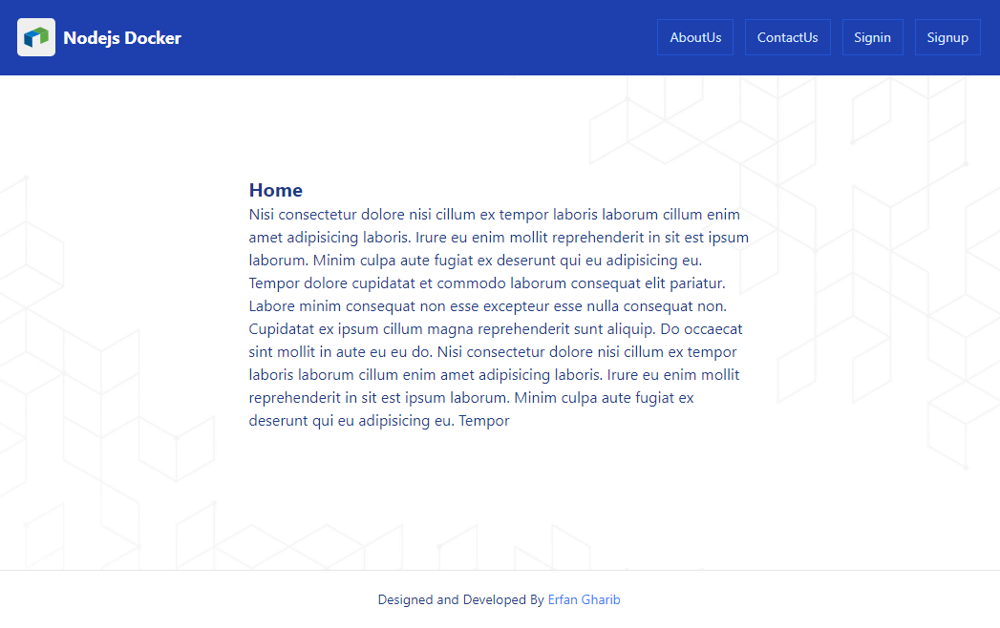
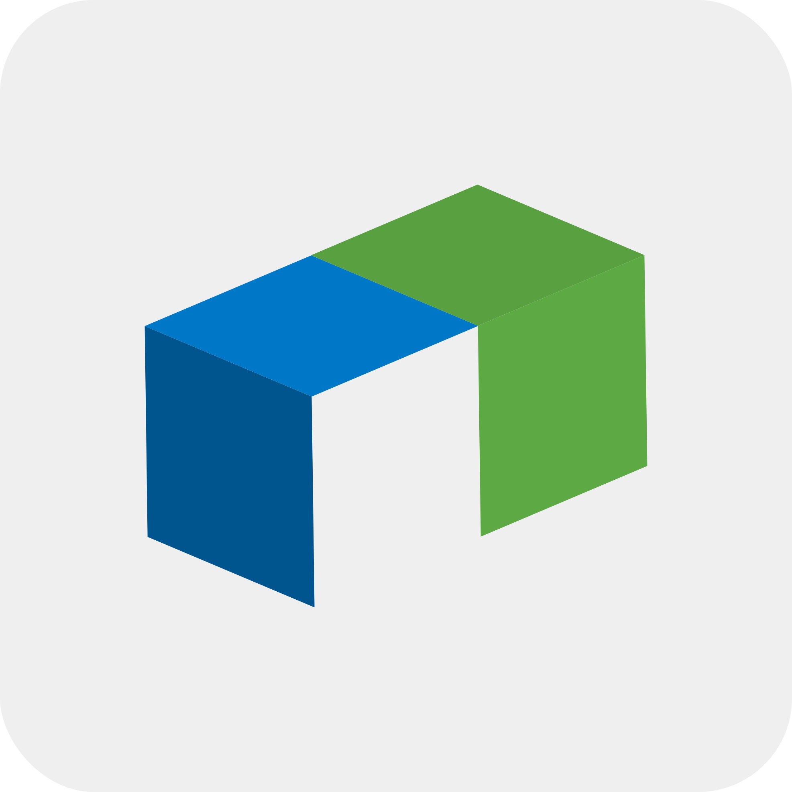

<!--  -->
# Nodejs Docker
- Full responsive Website
- Sample Nodejs Project 
<!-- - Production link: [https://shapo-bay.vercel.app/shop](https://shapo-bay.vercel.app/shop) -->

## Technologies
- Nodejs
- Express
- Mongodb
- Docker

## Pages
- Home
- AboutUs
- ContactUs
- SignIn
- SignUp

## Options
- User can send message to website admin via contactUs form
- Create an account
- Sign in to existing account
- Logout

## Run Project
### `npm install`
Install all packages used in app

### `npm run build`
Build App into Dist folder.

### `npm start`
Runs the app in the production mode.
Open [http://localhost:5000](http://localhost:5000) to view it in your browser.

## Project Status
inComplete
